<div align="center">

<picture>
  <source media="(prefers-reduced-motion: reduce)" srcset="assets/banner-static.svg" />
  
</picture>

<picture>
  <source media="(prefers-reduced-motion: reduce)" srcset="assets/greetings-static.svg" />
  
</picture>

### Most AI demos work once. I care about the part that has to work every time.

So this page is not a list of things I have used. It is the **failure model I design against**,
and the code where I handle each failure.

**Looking for AI Engineer roles.** Also open to Data Science, Data Engineering and Data Analytics.

Western Australia · **Full work rights to September 2028** on a subclass 485 graduate visa, so there is nothing to sponsor

[LinkedIn](https://au.linkedin.com/in/itechno) · [namash.work@gmail.com](mailto:namash.work@gmail.com) · [All repositories](https://github.com/namashworks?tab=repositories)

</div>

---

<div align="center">

<picture>
  <source media="(prefers-reduced-motion: reduce)" srcset="assets/city.jpg" />
  
</picture>

<sub>An Iron Dome inspired illustration of the failure model below. A metaphor for how I think about reliability, not a diagram of a real system.</sub>

</div>

## הגנה לעומק · The threat model

Iron Dome is layered because no single shield is trusted to catch everything. Neither is any single
check in an AI system. Three things kill these systems in production, they fail at different moments,
and each one needs its own layer.

| The failure | What it actually costs | The layer that stops it | Where I built that layer |
| :-- | :-- | :-- | :-- |
| **Fabricated fact** | A confident wrong answer sends someone down the wrong path with full confidence. A gap only sends them back to the source. The confident version is worse. | **Evidence** | [egkg-architecture](https://github.com/namashworks/egkg-architecture) |
| **Silent regression** | Quality drops and nothing tells you. The first report comes from a user, and by then it has been wrong for weeks. | **Evaluation** | [stam-ml](https://github.com/namashworks/stam-ml) |
| **Hardware drift** | Yesterday's benchmark quietly stops being true. Every number you compare against it is now a lie. | **Observability** | [qledger](https://github.com/namashworks/qledger) |

<details>
<summary><b>Evidence · the rule that makes a claim auditable</b></summary>

<br>

EGKG is an **architecture document**, not a shipped product. Point an LLM at lecture notes and ask for
a concept graph and the failures are the dangerous kind: invented concepts, fabricated prerequisites,
mastery asserted with no supporting behaviour. So the design turns on one rule:

> Every node and edge stores an `evidence_span` pointing at the exact source text or assessment event
> it came from. **No evidence, no node.**

Levels 1 to 3 can be extracted from material. Levels 4 and 5, reasoning and mastery, have to be earned
from behaviour. The system is built to say *not enough evidence* rather than guess, because in a study
tool "you have mastered recursion" said wrongly is worse than saying nothing.

To be exact about what this buys: provenance makes a claim **auditable**, not **true**. It does not
make the source correct, and it does not prove the claim follows from the span. It moves the argument
from "trust the model" to "here is the line it came from, go and check", which is the only version a
reviewer can actually work with.

</details>

<details>
<summary><b>Evaluation · why every STAM prediction can be interrogated</b></summary>

<br>

A STAM prediction is an inverse-distance vote of the nearest anchors, so you can ask which anchors
voted and by how much, and get objects back rather than a saliency heatmap:

```python
# prediction = inverse-distance weighted vote of the k nearest anchors
w = {i: 1.0 / (l1(x, a[i]) + eps) for i in neighbours(x)}
y = sum(w[i] * theta[i] for i in w) / sum(w.values())

# and because anchors are objects, not weights, this is a real question:
explain(x) -> [(anchor_id, coordinate, weight, theta), ...]
```

Anchors also gain mass as they age, so old knowledge resists being overwritten while new anchors stay
mobile. That is how it learns online without a replay buffer.

Two honest limits. Neural networks are not uninterpretable, they just have different tools; an anchor
trace is a different mechanism, not an exclusive ability. And being able to inspect a prediction is
not the same as knowing it is right. Catching a regression still needs a held-out set, a baseline and
a number you compare against it.

</details>

<details>
<summary><b>Observability · catching drift by storing enough to replay the past</b></summary>

<br>

You cannot notice drift unless the old run is still reproducible. QLedger persists the whole envelope,
not just the answer:

```python
with QLedger("research.db") as db:
    result = db.run(qc, experiment_id=exp, shots=4096, seed_simulator=42)
# seed, shots, backend, timing and the noise profile are all stored
```

T1, T2, gate fidelities and readout errors are tracked over time, which is what turns "the numbers
moved" into "something changed on this date, and here is the run to compare against".

Worth being precise, because this is where people overclaim. A stored seed reproduces a **simulator**
run under the same conditions. **Physical quantum hardware is stochastic and drifts**, so no seed
makes a real device repeat itself. What the record buys you on hardware is a comparable baseline, not
a replay.

</details>

## 今 · Now

- **Building** [`Bridge ADK`](https://github.com/namashworks/Bridge-ADK). Every vendor ships an agent SDK and none of them talk to each other, so getting two agents to cooperate means hand-writing about fifty lines of executor, card and handler boilerplate per agent. That plumbing should be written once.

```python
import bridge_adk

bridge_adk.serve(my_agent, port=9000)          # Google ADK, OpenAI or Claude, auto-detected
remote = bridge_adk.connect("http://localhost:9000")
answer = await remote.ask("Summarize the latest sales report")
```

One thing that belongs next to that snippet: **the documented v0.1 server has no built-in
authentication.** It is for a trusted network or a local loop. Anything reachable from outside needs
an access boundary in front of it, and the README says so rather than letting someone find out.

- **Publishing** [`STAM`](https://github.com/namashworks/stam-ml), a learning algorithm of my own: CPU native, online, and traceable back to the anchors that made the call
- **Learning** quantum error mitigation, and how far a 3B model can be pushed on careful clinical language
- **Ask me about** agent interoperability, LoRA on small models, knowledge graphs that refuse to invent things, and why a benchmark beats an adjective

<div align="center">
<picture>
  <source media="(prefers-reduced-motion: reduce)" srcset="assets/bridge-static.svg" />
  
</picture>
<sub><b>One call, three vendor SDKs, one A2A wire.</b> The framework is detected at runtime, so there is nothing to subclass and no protocol code to write.</sub>
</div>

## 프로젝트 · The rest of the work

Three repositories are covered in the threat model above. These are the other three worth your time.

| Project | What it is | The hard part |
| :-- | :-- | :-- |
| **[Bridge ADK](https://github.com/namashworks/Bridge-ADK)** | `bridge_adk.serve(agent)` puts an agent from any of the three major vendor SDKs on the A2A wire. | Auto detecting the framework, so the user writes zero protocol code and subclasses nothing. Limits are documented, it is early. |
| **[Genetic Transformer](https://github.com/namashworks/Genetic-Transformer)** | A transformer for translating between English and DNA, RNA, codons, amino acids and protein. | Giving attention the codon table as structure, instead of hoping it rediscovers biology from scratch. |
| **[Gen Z Medical Advisor](https://github.com/namashworks/Genz-medical-advisor)** | Qwen 2.5 3B, LoRA fine tuned on synthetic data, for health guidance people will actually read. **Experimental research, not a clinically validated product.** | Refusal behaviour at 3B, where there is no headroom to be sloppy about what the model declines to answer. |

## STAM, in motion

Most prototype methods split a node when the **error is large**, which means noise makes them split
forever. STAM splits on the **entropy of the error signs** instead, and that one change is the reason
the panel below is worth watching.

- **On the left**, each arriving sample pulls the three nearest anchors toward it. The pull is divided
  by mass, so anchors that have won many samples barely move. Early structure sets, new anchors stay
  mobile. That is the stability-plasticity trade, handled without a replay buffer.
- **On the right**, the last twelve error *signs*. Balanced plus and minus reads as noise, entropy
  stays near 1.0, and the anchor holds. One-sided signs suggest the model is biased there, entropy
  collapses, and below **0.7** the anchor divides. Until twelve signs have accumulated the panel says
  **collecting**, because a half-full window is not a reading.
- **The target steps at u = 0.62.** Anchors that land on that step get one-sided errors and split.
  Anchors in the noisy flat region keep a mixed window and stay put. Five anchors become nine, and the
  Gabriel graph rewires around each new one.

<div align="center">
<picture>
  <source media="(prefers-reduced-motion: reduce)" srcset="assets/stam-static.svg" />
  
</picture>
<sub><b>That panel is the algorithm actually running.</b> <a href="tools/make-stam.mjs">tools/make-stam.mjs</a> implements KAF, the entropy trigger and the Gabriel graph, runs 224 samples, and records the real trajectory into keyframes. It ships in this repository, so you can run it and get the same panel. Illustration parameters are noted at the top of the file.</sub>
</div>

<details>
<summary><b>The rule that tells noise apart from structure</b></summary>

<br>

```python
def should_split(error_signs, threshold=0.7):
    """Shannon entropy of the SIGN sequence, not the error magnitude."""
    p = sum(error_signs) / len(error_signs)          # fraction that were positive
    if p in (0.0, 1.0):
        return True                                   # perfectly one-sided: split
    H = -p * log2(p) - (1 - p) * log2(1 - p)
    return H < threshold                              # biased, not noisy: split
```

`H` near **1.0** means the errors are as likely positive as negative. That is stochastic noise, and
splitting there just fits the noise. `H` near **0.0** means the anchor is wrong in the same direction
every time, which is a real gap in the model. Only the second case earns a new anchor.

A runnable version of just the statistic is in [`examples/entropy.py`](examples/entropy.py).

It is a **heuristic**, and worth saying so plainly. Balanced signs do not prove the errors are random,
and a short one-sided window does not prove underfitting or drift. Window length, error magnitude and
sample size all move the answer. What it buys is a cheap, principled reason to look, in place of
splitting every time an error happens to be large.

</details>

## 系統 · The whole stack

Sixteen repositories, and they are not a random pile. Seven rings, lighting from the centre outward:
the algorithm I wrote myself burning at the core, quantum tooling out at the frontier.

**The order is not deployment order, it is how much each ring assumes.** The **learning core** assumes
least: STAM is mine, and it is the only thing here not sitting on top of somebody else's model.
**Data and formats** comes next, because you cannot model what you cannot move, and converters are
where the unglamorous correctness bugs live. **Models** is where architecture starts to matter.
**Applied AI** is a model pointed at a domain where being wrong costs something, which is why the
medical one is labelled experimental. **Agents** is a model allowed to call things, so the failure
mode stops being a bad sentence and starts being a bad action. **Knowledge** is a model that has to
be able to refuse. And **quantum** sits at the edge because the tooling there is the least settled,
which is exactly why the first thing I built for it was a ledger rather than a model.

Read it inward and it is one question repeated: how much of this still works if the layer under it
changes. That is the threat model at the top of this page, asked one level up.

It is a map of where things sit, not a claim that these sixteen run as one deployed system.

<div align="center">
<picture>
  <source media="(prefers-reduced-motion: reduce)" srcset="assets/stack-static.svg" />
  
</picture>
<sub><b>Twenty four seconds, and it loops.</b> Every ring is named on itself and carries one node per repository, sixteen across the seven. The core ignites, the rings light outward, a moon waxes new to full, and at full moon a <b>Rinne Sharingan</b> opens on it and the sky goes crimson: 無限月読, <i>Infinite Tsukuyomi</i>, from the end of <i>Naruto Shippuden</i>. Then the stack itself wakes. Seven rings round a core already are a <b>Rinnegan</b>, so the genjutsu does not bury the architecture, it opens it: a pupil forms at the core, ripples run outward, and the layers read more clearly than anywhere else in the cycle. That awakened frame is the one reduced motion gets.</sub>
</div>

<details>
<summary><b>Every repository in that stack</b></summary>

<br>

- **Learning core:** [stam-ml](https://github.com/namashworks/stam-ml) · [movie-rating-prediction-ml-pipeline](https://github.com/namashworks/movie-rating-prediction-ml-pipeline)
- **Data and formats:** [Json-to-Toon-converter](https://github.com/namashworks/Json-to-Toon-converter) · [multiformat-toon](https://github.com/namashworks/multiformat-toon) · [Synthetic-Data-Generator-with-converter](https://github.com/namashworks/Synthetic-Data-Generator-with-converter)
- **Models:** [Genetic-Transformer](https://github.com/namashworks/Genetic-Transformer) · [FNet-Pytorch-Implementation](https://github.com/namashworks/FNet-Pytorch-Implementation)
- **Applied AI:** [Genz-medical-advisor](https://github.com/namashworks/Genz-medical-advisor) · [Successapp](https://github.com/namashworks/Successapp) · [autoRECON](https://github.com/namashworks/autoRECON)
- **Agents:** [Bridge-ADK](https://github.com/namashworks/Bridge-ADK) · [IPipe](https://github.com/namashworks/IPipe) · [Chatform](https://github.com/namashworks/Chatform)
- **Knowledge:** [egkg-architecture](https://github.com/namashworks/egkg-architecture) · [StudyMate](https://github.com/namashworks/StudyMate)
- **Quantum:** [qledger](https://github.com/namashworks/qledger)

All sixteen are my own work. [Forks and learning explorations](https://github.com/namashworks?tab=repositories&type=fork) are kept separate on purpose.

</details>

## 查询 · Before there is a model, there is a table

Observability is not a dashboard, it is being able to ask a straight question afterwards and get an
answer you can defend. This is the shape of that question.

<div align="center">
<picture>
  <source media="(prefers-reduced-motion: reduce) and (max-width: 560px)" srcset="assets/query-mobile-static.svg" />
  <source media="(max-width: 560px)" srcset="assets/query-mobile.svg" />
  <source media="(prefers-reduced-motion: reduce)" srcset="assets/query-static.svg" />
  
</picture>
</div>

The interesting column is `scored`. `simulator_d` recorded three runs but only two produced a fidelity,
so `AVG` skips the null and `COUNT(*)` does not. Reporting one number without the other is how a
dashboard tells you a comfortable lie.

<details>
<summary><b>The query, and the four rows it returns</b></summary>

<br>

```sql
SELECT backend,
       ROUND(AVG(fidelity), 3) AS mean_fidelity,
       COUNT(fidelity)         AS scored,
       COUNT(*)                AS runs
FROM   experiment_runs
WHERE  circuit = 'ghz_8q'
GROUP BY backend
ORDER BY mean_fidelity DESC;
```

| backend | mean_fidelity | scored | runs |
| :-- | --: | --: | --: |
| simulator_a | 0.982 | 3 | 3 |
| simulator_b | 0.964 | 3 | 3 |
| simulator_c | 0.941 | 3 | 3 |
| simulator_d | 0.902 | 2 | 3 |

The backends are named `simulator_a` to `simulator_d` because this is a synthetic fixture, not a
hardware benchmark.

Those four rows are executed output, and you do not have to take my word for it. The fixture and the
query ship in this repository: [`examples/fixture.sql`](examples/fixture.sql) and
[`examples/query.sql`](examples/query.sql). Run them against any SQLite and you get the table above.
A test does exactly that and fails if the picture, this table and the `.sql` file ever disagree.

</details>

## 進路 · Where I want this pointed

Two lists, and the difference between them matters. The left one has repositories behind it. The right
one does not yet, which is why it is drawn dashed.

<div align="center">
<picture>
  <source media="(prefers-reduced-motion: reduce)" srcset="assets/roadmap-static.svg" />
  
</picture>
<sub><b>Solid is work that exists. Dashed is work that does not.</b> I would rather be clear about which list a thing is on, because a roadmap that does not separate the two is just a wish printed in a serious font.</sub>
</div>

<details>
<summary><b>The same two lists as text</b></summary>

<br>

- **Already touched** · healthcare and medtech · computational biology · quantum tooling · agent infrastructure · learning systems
- **Want to work on next** · robotics and autonomy · mining technology, the autonomous haulage and ore body side · space, telemetry and on board inference · and AI itself, the tooling layer rather than the demo layer

The second list is ambition, not a claim. Nothing on it has a repository behind it yet, and this page
would be worth less if it pretended otherwise.

</details>

## Arbeitsweise · How I work

Nine ideas that changed how I engineer, and where I picked each one up. Some are old expressions
with long histories. Some are industrial habits, and I have said which is which. **None of them are
claims about what people from those places are like.**

| | Idea | What it looks like in my repos |
| :-- | :-- | :-- |
|  **Japan** | 現地現物 *genchi genbutsu*, "actual place, actual thing". From the Toyota Way: go to the source and see the facts yourself. | I read the raw rows and the failure cases before I choose a model |
|  **Korea** | 빨리빨리 *ppalli ppalli*, "quickly, quickly". Koreans argue about its cost as much as its benefit, and both sides have a point. | Every architecture doc ends in a two week vertical slice, not a roadmap |
|  **Germany** | *Gründlichkeit*: do it properly, not merely sufficiently. | A licence, a `CITATION.cff` and a test folder before I call a repo public |
|  **France** | *"Ce que l'on conçoit bien s'énonce clairement"*, Boileau, 1674. Clear expression follows clear thought. | If I cannot state a design in one sentence, the design is not done, and rewriting the sentence will not fix that |
|  **Israel** | ראש גדול *rosh gadol*, "big head": own the objective, not just the instruction. Its opposite, *rosh katan*, is doing exactly what you were told. | I wrote a new learning algorithm rather than tune another boosted tree |
|  **China** | 实事求是 *shi shi qiu shi*, "seek truth from facts". About two thousand years old, from the Book of Han. | Benchmarks and ablations, not adjectives |
|  **Taiwan** | Not a saying, an industrial habit. Taiwan's semiconductor industry competes not only on leading-edge technology, but on **yield**: manufacturability, process stability and defect reduction. | A design that cannot run reliably at cost is not a design, so every doc carries an operating envelope |
|  **Canada** | Canada has a National Standard on plain language, CAN-ASC-3.1:2025. Write so the next reader does not need you in the room. | If a doc needs me there to explain it, the doc is not finished |
|  **Australia** | *Fair dinkum*: genuine, honest, no varnish. | If it does not work yet, the README says so |

<details>
<summary><b>Where each of these comes from, so you can check me</b></summary>

<br>

A page that argues for evidence should carry its own. Every claim above was checked against a primary
source, and the awkward details are kept rather than smoothed over.

- **Japan** · Toyota's own wording is *"Go and see for yourself: the best practice is to go and see the location or process where the problem exists in order to solve that problem more quickly and efficiently."* Worth noting: Toyota lists it as a supporting practice under the principle *Observe thoroughly*, not as a standalone pillar. [Toyota Europe, The Toyota Way](https://www.toyota-europe.com/world-of-toyota/this-is-toyota/the-toyota-way)
- **Korea** · The debate is real and Korean-led, not something imported. [Korea Herald, *Koreans do things quickly. Is it efficiency or lack of patience?*](https://www.koreaherald.com/view.php?ud=20240911050866)
- **Germany** · Duden gives *Gründlichkeit* as **"das Gründlichsein; Gewissenhaftigkeit, Sorgfalt"**, thoroughness, conscientiousness, care. [Duden](https://www.duden.de/rechtschreibung/Gruendlichkeit)
- **France** · *L'Art poétique*, Chant I, 1674: *"Ce que l'on conçoit bien s'énonce clairement, / Et les mots pour le dire arrivent aisément."* The widely repeated *"Ce qui se conçoit bien"* is a misquote. Boileau was himself reworking Horace. [Wikisource](https://fr.wikisource.org/wiki/Boileau_-_%C5%92uvres_po%C3%A9tiques/L%E2%80%99Art_po%C3%A9tique/Chant_I)
- **Israel** · *Rosh gadol* and *rosh katan* come out of IDF culture and carried into Israeli working life. [Nathan Zeldes, *Rosh Gadol: how you can manage for initiative*](https://www.nathanzeldes.com/blog/2013/03/rosh-gadol-how-you-can-manage-for-initiative-and-get-away-with-it/)
- **China** · 实事求是 first appears in the biography of Prince Xian of Hejian in the **Book of Han**, compiled by Ban Gu (32 to 92 CE), describing scholarship that verifies claims against evidence. It later acquired a distinct political register when Mao used it at Yan'an in 1938. I am using the older, scholarly sense. [Seek truth from facts](https://en.wikipedia.org/wiki/Seek_truth_from_facts)
- **Taiwan** · TSMC's own engineering page describes *"remarkable results in yield improvement and quality control"* and *"process stability"*. This is an industrial practice, not a saying. [TSMC, Engineering Performance Optimization](https://www.tsmc.com/english/dedicatedFoundry/manufacturing/engineering)
- **Canada** · **CAN-ASC-3.1:2025 Plain Language**, a National Standard of Canada published in October 2025 by Accessibility Standards Canada. [Accessibility Standards Canada](https://accessible.canada.ca/creating-accessibility-standards/can-asc-31-plain-language)
- **Australia** · *Dinkum* means *"reliable, genuine, honest, true"*. It came from British dialect where it meant work, or a fair share of the work, and the sense of fairness carried into the Australian meaning. [Australian National Dictionary Centre, ANU](https://history.cass.anu.edu.au/centres/andc/australian-words-d)

</details>

## 世界 · Countries I am interested to work in

| Continent | Countries |
| :-- | :-- |
| **Asia** |  Japan ·  South Korea ·  China ·  Taiwan ·  Thailand ·  Israel |
| **Europe** |  Germany ·  France ·  Switzerland ·  Sweden ·  Finland ·  Estonia |
| **North America** |  Canada |
| **Oceania** |  Australia |

<div align="center">
<picture>
  <source media="(prefers-reduced-motion: reduce)" srcset="assets/worldmap-static.svg" />
  
</picture>
</div>

## Contact

The fastest way to reach me is email or LinkedIn. The most interesting way is an issue on one of the
repositories above, because then the conversation starts with something concrete.

**[namash.work@gmail.com](mailto:namash.work@gmail.com)** · **[Connect on LinkedIn](https://au.linkedin.com/in/itechno)**

For a recruiter, the short version: **AI Engineer roles, Western Australia, full work rights to
September 2028 on a subclass 485 graduate visa.** Open to Data Science, Data Engineering and Data
Analytics as well.

<div align="center">

<picture>
  <source media="(prefers-reduced-motion: reduce)" srcset="assets/thanks-static.svg" />
  
</picture>

*If it does not work yet, the README says so.*

</div>
