<div align="center">

<picture>
  <source media="(prefers-reduced-motion: reduce)" srcset="assets/banner-static.svg" />
  
</picture>

<picture>
  <source media="(prefers-reduced-motion: reduce)" srcset="assets/greetings-static.svg" />
  
</picture>

### I build the reliability layer under AI systems.

Most AI demos work once. I care about the part that has to work every time: the evidence rule,
the benchmark, the adapter, the failure mode that made it into the README before it made it into production.

**Looking for AI Engineer roles.** Also open to Data Science, Data Engineering and Data Analytics.

[LinkedIn](https://au.linkedin.com/in/itechno) · [All repositories](https://github.com/namashworks?tab=repositories) · Australia

</div>

---

## הגנה לעומק · Defence in depth

<div align="center">

<picture>
  <source media="(prefers-reduced-motion: reduce)" srcset="assets/city.jpg" />
  
</picture>

<picture>
  <source media="(prefers-reduced-motion: reduce)" srcset="assets/dome-layers-static.svg" />
  
</picture>

</div>

Iron Dome is layered on purpose: no single shield is trusted to catch everything. I build AI the same way.
**Evidence** for what goes in, **evaluation** for what comes out, **observability** for what happens next.

Watch what each layer stops, because that is the whole argument for having three. An **unsourced claim** never
reaches the model. A **silent regression** gets past the first shield and is caught by the eval before release.
**Production drift** gets past both and is caught by the logs, before a user is the one who notices.
Monitor drones patrol each shield in between. The illustration is a metaphor for how I think about reliability,
not a diagram of any real system.

## 今 · Now

- **Building** [`Bridge ADK`](https://github.com/namashworks/Bridge-ADK), so a Google ADK, OpenAI or Claude agent can speak A2A in one line instead of fifty
- **Publishing** [`STAM`](https://github.com/namashworks/stam-ml), a learning algorithm of my own: CPU native, online, and traceable back to the anchors that made the call
- **Learning** quantum error mitigation, and how far a 3B model can be pushed on careful clinical language
- **Ask me about** agent interoperability, LoRA on small models, knowledge graphs that refuse to invent things, and why a benchmark beats an adjective

<div align="center">
<picture>
  <source media="(prefers-reduced-motion: reduce)" srcset="assets/bridge-static.svg" />
  
</picture>
<sub><b>Bridge ADK.</b> One call wraps an agent from any of the three major vendor SDKs and puts it on the A2A wire.</sub>
</div>

## 프로젝트 · Selected work

Six entry points. Each repository carries its own scope and its own limits.

| Project | What it is | The hard part |
| :-- | :-- | :-- |
| **[STAM](https://github.com/namashworks/stam-ml)** | A learner I designed: sparse anchors connected by Gabriel graph topology. No GPU, no weight matrix, fixed memory. | Stability versus plasticity with no replay buffer. Anchors gain mass as they age, so old knowledge resists and new knowledge stays mobile. |
| **[Bridge ADK](https://github.com/namashworks/Bridge-ADK)** | `bridge_adk.serve(agent)` puts an agent from any of the three major vendor SDKs on the A2A wire. | Auto detecting the framework, so the user writes zero protocol code and subclasses nothing. Limits are documented, it is early. |
| **[QLedger](https://github.com/namashworks/qledger)** | Quantum experiment lifecycle: Qiskit, Cirq and PennyLane behind one adapter, every seed and result in one portable SQLite file. | A universal circuit IR, plus noise drift tracking and heavy output benchmark definitions. |
| **[EGKG](https://github.com/namashworks/egkg-architecture)** | An **architecture document**, not a shipped product: how a student knowledge graph can refuse to invent things. | Nothing enters the graph without an evidence span. Mastery has to be earned from behaviour, never extracted from text. |
| **[Genetic Transformer](https://github.com/namashworks/Genetic-Transformer)** | A transformer for translating between English and DNA, RNA, codons, amino acids and protein. | Giving attention the codon table as structure, instead of hoping it rediscovers biology from scratch. |
| **[Gen Z Medical Advisor](https://github.com/namashworks/Genz-medical-advisor)** | Qwen 2.5 3B, LoRA fine tuned on synthetic data, for health guidance people will actually read. **Experimental research, not a clinically validated product.** | Getting refusal and safety behaviour right at 3B, where there is no headroom to be sloppy. |

<div align="center">
<picture>
  <source media="(prefers-reduced-motion: reduce)" srcset="assets/stam-static.svg" />
  
</picture>
<sub><b>STAM, learning.</b> Anchors drift onto the manifold, connect into a topology, and get pulled toward each new sample. Older anchors are heavier and resist, which is how it stays stable without a replay buffer.</sub>
</div>

## 系統 · The whole stack

Six projects fit in a table. There are sixteen, and they are not a pile, they are a stack.

<div align="center">
<picture>
  <source media="(prefers-reduced-motion: reduce)" srcset="assets/stack-static.svg" />
  
</picture>
<sub><b>Seven layers, sixteen repositories, no forks.</b> An algorithm of my own at the bottom, quantum tooling at the top, and everything between built so the layer above it can trust it.</sub>
</div>

<details>
<summary><b>Every repository in that stack</b></summary>

<br>

- **Learning core:** [stam-ml](https://github.com/namashworks/stam-ml) · [movie-rating-prediction-ml-pipeline](https://github.com/namashworks/movie-rating-prediction-ml-pipeline)
- **Data and formats:** [Json-to-Toon-converter](https://github.com/namashworks/Json-to-Toon-converter) · [multiformat-toon](https://github.com/namashworks/multiformat-toon) · [Synthetic-Data-Generator-with-converter](https://github.com/namashworks/Synthetic-Data-Generator-with-converter)
- **Models:** [Genetic-Transformer](https://github.com/namashworks/Genetic-Transformer) · [FNet-Pytorch-Implementation](https://github.com/namashworks/FNet-Pytorch-Implementation)
- **Applied AI:** [Genz-medical-advisor](https://github.com/namashworks/Genz-medical-advisor) · [Successapp](https://github.com/namashworks/Successapp) · [autoRECON](https://github.com/namashworks/autoRECON)
- **Agents:** [Bridge-ADK](https://github.com/namashworks/Bridge-ADK) · [IPipe](https://github.com/namashworks/IPipe) · [Chatform](https://github.com/namashworks/Chatform)
- **Knowledge:** [egkg-architecture](https://github.com/namashworks/egkg-architecture) · [StudyMate](https://github.com/namashworks/StudyMate)
- **Quantum:** [qledger](https://github.com/namashworks/qledger)

Sixteen repositories, all my own work. [Forks and learning explorations](https://github.com/namashworks?tab=repositories&type=fork) are kept separate on purpose.

</details>

## 查询 · Data before the model

Before there is a model there is a table, and someone has to ask it a straight question.

<div align="center">
<picture>
  <source media="(prefers-reduced-motion: reduce)" srcset="assets/query-static.svg" />
  
</picture>
<sub><b>A synthetic experiment table, asked a straight question.</b> The backends are named simulator_a to simulator_d because this is a fixture, not a hardware benchmark. The interesting column is <code>scored</code>: simulator_d recorded three runs but only two of them produced a fidelity, so <code>AVG</code> skips the null and <code>COUNT(*)</code> does not.</sub>
</div>

<details>
<summary><b>Read the query as text</b></summary>

<br>

```sql
SELECT backend,
       ROUND(AVG(fidelity), 3) AS mean_fidelity,
       COUNT(fidelity)         AS scored,
       COUNT(*)                AS runs
FROM   experiment_runs
WHERE  circuit = 'ghz_8q'
GROUP BY backend
ORDER BY mean_fidelity DESC;
```

| backend | mean_fidelity | scored | runs |
| :-- | --: | --: | --: |
| simulator_a | 0.982 | 3 | 3 |
| simulator_b | 0.964 | 3 | 3 |
| simulator_c | 0.941 | 3 | 3 |
| simulator_d | 0.902 | 2 | 3 |

Those four rows are executed output, not typed by hand. The fixture and the query live beside the
build tooling for this page, and a test runs them against SQLite and compares the result to the
numbers drawn in the panel above.

</details>

## Where I want this pointed

**Already touched:** healthcare and medtech · computational biology · quantum tooling · agent infrastructure · learning systems

**Want to work on next:** robotics and autonomy · mining technology, the autonomous haulage and ore body side · space, telemetry and on board inference · and AI itself, the tooling layer rather than the demo layer

I would rather be clear about which list a thing is on. The second one is ambition, not a claim.

## Arbeitsweise · How I work

Eight places, eight ideas about engineering I have actually taken something from.

| | Idea | What it looks like in my repos |
| :-- | :-- | :-- |
|  **Japan** | 現地現物 *genchi genbutsu*, go and look at the actual thing | I read the raw rows and the failure cases before I choose a model |
|  **Korea** | 빨리빨리 *ppalli ppalli*, speed is itself a feature | Every architecture doc ends in a two week vertical slice, not a roadmap |
|  **Germany** | *Gründlichkeit*, thoroughness as a form of respect | A licence, a `CITATION.cff` and a test folder before I call a repo public |
|  **Israel** | ראש גדול *rosh gadol*, take the bigger job than the one you were handed | I wrote a new learning algorithm rather than tune another boosted tree |
|  **China** | 实事求是 *shi shi qiu shi*, seek truth from facts | Benchmarks and ablations, not adjectives |
|  **Taiwan** | Yield thinking | A design that cannot run reliably at cost is not a design, so every doc carries an operating envelope |
|  **Canada** | Review first, in plain language | `docs/` gets written before the API is frozen |
|  **Australia** | Fair dinkum | If it does not work yet, the README says so |

## Outils · Toolbox

<div align="center">
<picture>
  <source media="(prefers-reduced-motion: reduce)" srcset="assets/toolbox-static.svg" />
  
</picture>
</div>

<details>
<summary><b>The same list as text</b></summary>

<br>

- **Code and data** · Python · SQL · SQLite · JavaScript · pandas · NumPy
- **Models** · PyTorch · Transformers · LoRA / PEFT · scikit-learn
- **Agents** · Google ADK · OpenAI Agents SDK · Claude Agent SDK · A2A
- **Quantum** · Qiskit · Cirq · PennyLane
- **Workflow** · Git · GitHub Actions · Jupyter · tests and reproducible examples

Everything here appears in a repository above. I have left off tools I have only read about.

</details>

## Contact

I read everything. The fastest way to reach me is LinkedIn, and the most interesting way is an issue on one of the repositories above.

**[Connect on LinkedIn](https://au.linkedin.com/in/itechno)**

---

<div align="center">

*If it does not work yet, the README says so.*

**よろしくお願いします · 잘 부탁드립니다 · 请多指教 · G'day**

</div>
